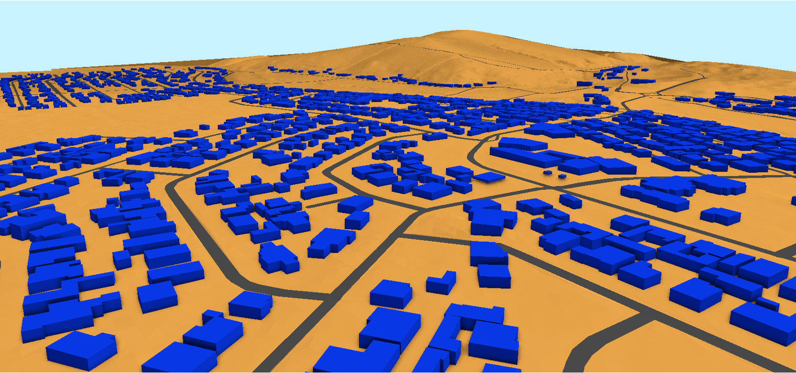

# Welcome to *geo3D*. 

*geo3D* is a free and open-source tool for creating 3D City Models, to enhance Geography and Sustainable Development Education.

With execution via Jupyter Notebook, *geo3D* provides an accessible and reproducible workflow, that *gives* students, educators and community organizations the ability to generate topologically correct Level-of-Detail 1 (LoD1) 3D models of their own  neighbourhoods, from an open geospatial data source; namely OpenStreetMap {cite}`osm2024`.

%
```{figure} LoD1.png
---
#height: 150px
name: lod2-fig
---
A LoD1 3D City Model of a peri-urban village; [Mamre](https://www.openstreetmap.org/relation/2198487).
```

The purpose of this book is illustrate, in a workshop *(tutorial-type)* format, how to create a LoD1 3D City Model, at a local level, and use these as learning tools to estimate a current population, predict a future population and estimate a Building Value Per Capita {cite}`ghosh2020` metric, of participants own communities.

A brief primer on *geo3D*, the workshop setup and content are accessible via the left menu of this webpage.

% [Building Value Per Capita](https://www.frontiersin.org/journals/sustainable-cities/articles/10.3389/frsc.2020.00037/full)

%This is a small sample book to give you a feel for how book content is
%structured.
%It shows off a few of the major file types, as well as some sample content.
%It does not go in-depth into any particular topic - check out [the Jupyter Book documentation](https://jupyterbook.org) for more information.
%
%Check out the content pages bundled with this sample book to see more.
%
%```{tableofcontents}
%```
